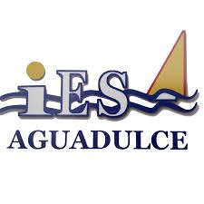

# Tarea 1:

### _Ruben Martinez Vico_ [@RubenMV7](https://github.com/RubenMV7)

> LMSGI - Lenguaje de Marcas y Sistemas de Gestión de la Información. DAW.
> 
> Año escolar: 2024-25
> 
> 

## Descripción.

Tarea 1 GIT Ruben Martinez Vico

[Publicación](https://24-25-lmsgi.github.io/LM-plantilla-tarea/)
